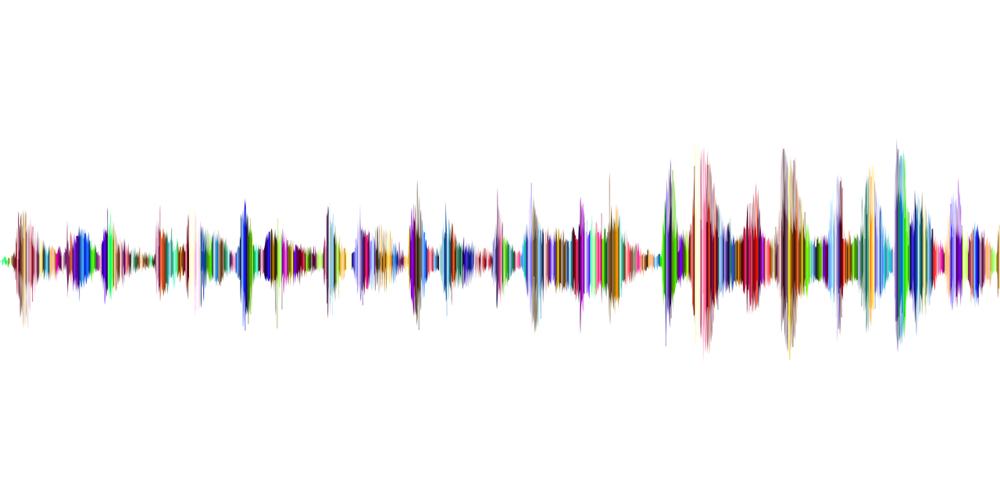
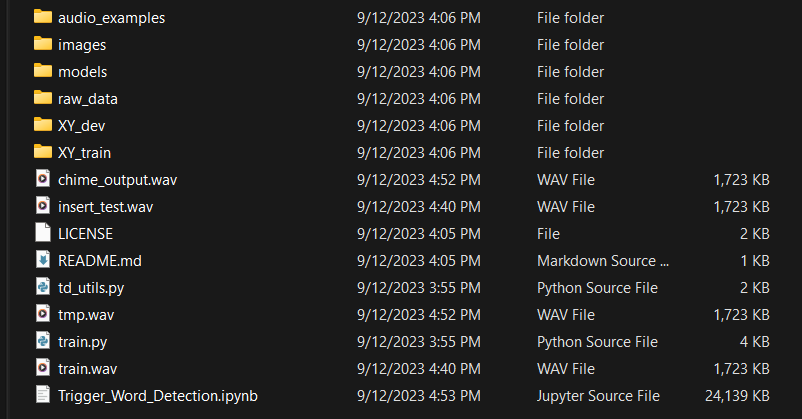

# Trigger Word Detection


This repository is the implementation of an algorithm for trigger word detection (sometimes also called keyword detection, or wake word detection) using a speech dataset.

Trigger word detection is the technology that allows devices like Amazon Alexa, Google Home, Apple Siri, and Baidu DuerOS to wake up upon hearing a certain word. For this notebook the trigger word will be "activate". Everytime it hears the word "activate", it will make a "chiming" sound.



### The Model

Here is the architecture of the model:


### Try It in your own Example
* Record a 10 second audio clip of you saying the word "activate" and other random words, and upload it to the root folder as `myaudio.wav`. 
* Be sure to upload the audio as a wav file. 
* If your audio is recorded in a different format (such as mp3) there is free software that you can find online for converting it to wav. 
* If your audio recording is not 10 seconds, the code below will either trim or pad it as needed to make it 10 seconds. 


## Setup

1. Clone this repository
```shell
git clone https://github.com/abel-shimeles/Trigger_Word_Detection.git
cd Trigger_Word_Detection
```
2. Download the [Trigger_word_files.zip](https://drive.google.com/file/d/1ajg2jIjXVUktu22E62aaaf9hzXJnKw6M/view) file from Google Drive then extract it and add copy all the files in the extracted folder and paste them in the root folder.

Your Folder structure should look like this:

